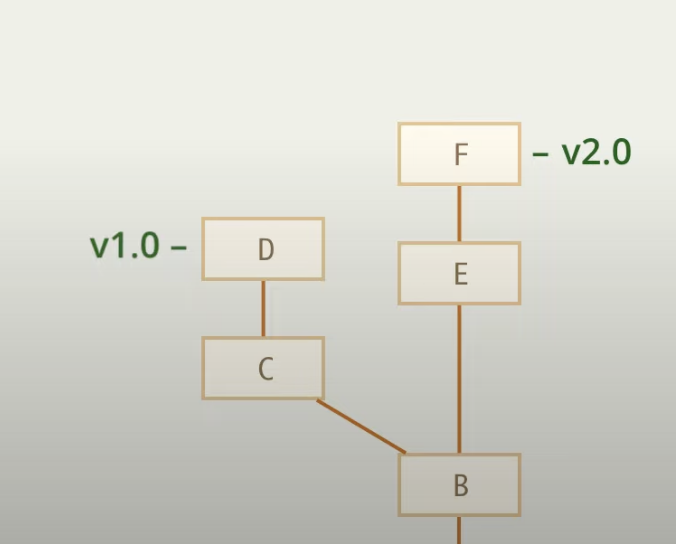
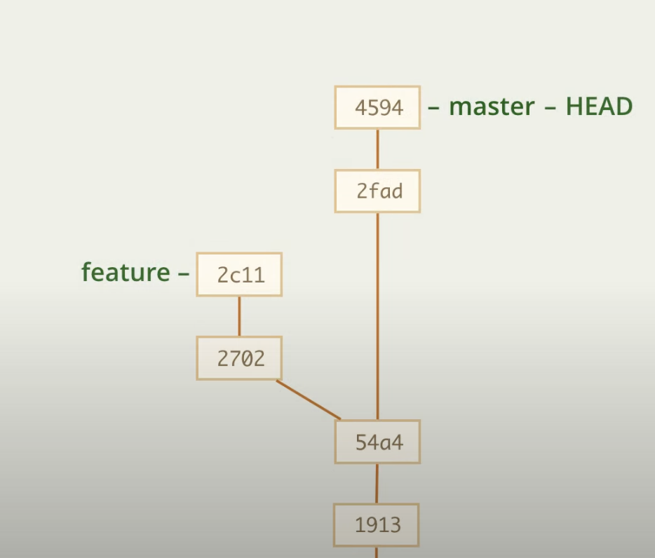

# Cherry-pick

Команда cherry-pick позволяет копировать коммит в другое место.

Представим, что у нас есть две ветки, затем мы находим в коммите B какой-то баг, теперь чтобы не исправлять его в обеих ветках, мы можем исправить его в одной, сделать коммит, а затем такой же коммит сделать в другой ветке

То есть мы изменения (diff) из одной ветки сделаем так же в другой 

## Практика

Представим, что нам нужно на мастер скопировать изменения в коммите 2702

    git cherry-pick 2702

Так же можно копировать несколько коммитов

    git cherry-pick 2702 2с11
    ||
    git cherry-pick master..feature (все коммиты feature, которых нет в master)

## Конфликт

В ситуации выше будет следующая последовательность действий

1. Git возьмет изменения (diff) коммита 2702 и внесет их в 4594, сделав новй коммит
2. Затем возьмет изменения комита 2c11 и уже вставит их в новый коммит, сделанный на прошлом шаге

Но если на одном из множества выбранных коммитов произойдет ошибка, то ситуация будет такая, что изменение первых коммитов уже сделаны, а будущих еще нет

Тогда у нас будет 3 варианта действий

1. 
        git cherry-pick --abort

    Данная команда отменяет все ранее сделанные с помощью cherry-pick изменения

1. 
        git cherry-pick --continue

    Данная команда продолжает выполнять изменения (если конфликт разрешен)

1. 
        git cherry-pick --quit

    Данная команда оставляет выполнение коммитов на том этапе, на котором оно остановилось

## Без коммита

Может получиться так, что нам требуется немного доработать изменения, то есть, мы хотим скопировать изменения, но не коммитить их сразу, так как нам нужно будет немного доработать их

В таком случае нужно воспользовать флагом -n || --no-commit

    git cherry-pick 2702 -n
    git cherry-pick 2702 --no-commit

В таком случае коммит не будет делаться, а только добавятся изменения в рабочую директорию и индекс