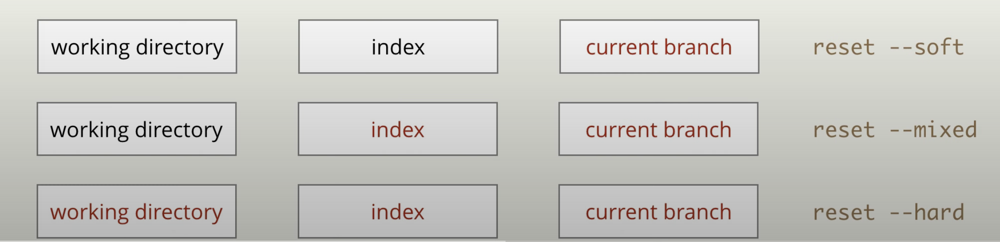
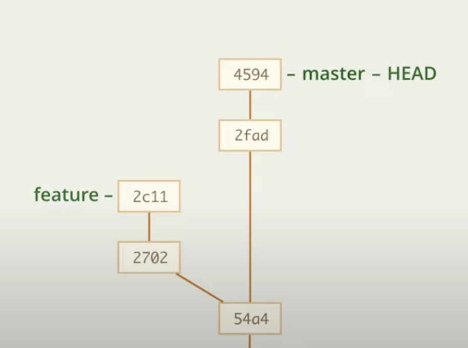
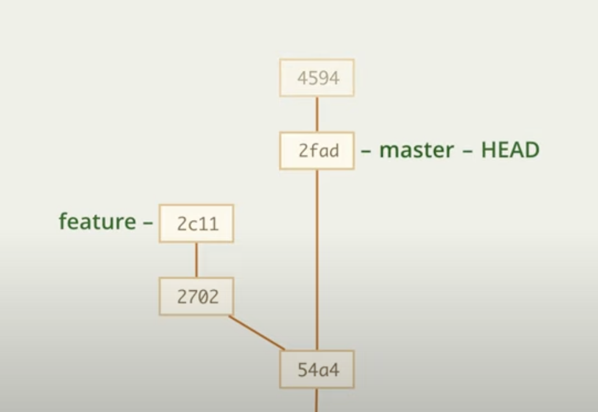
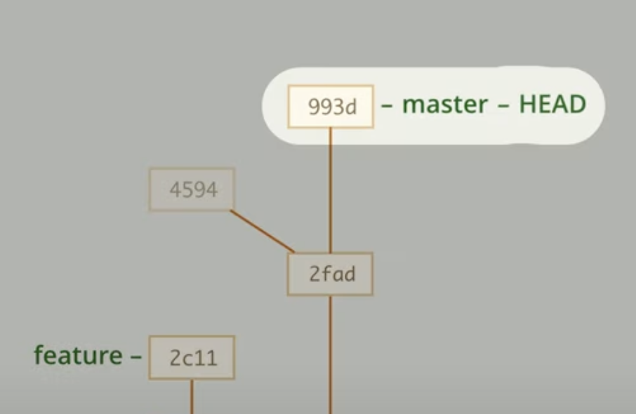
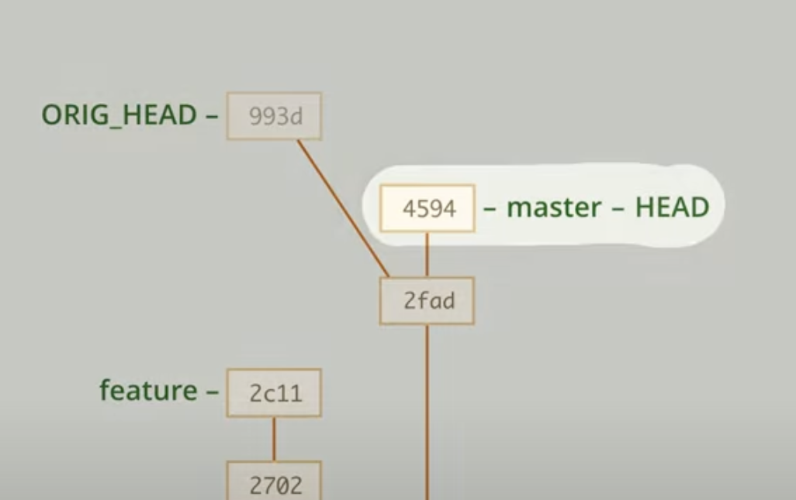

# reset 

Команда reset возвращает нас на определенный коммит.

# reset --hard

Команда reset --hard помимо возврата на определенный коммит так же сбрасывает index и рабочую директорию на данные из коммита.

То есть, если мы находимся на последнем коммите, а затем используем reset --hard, то наш index и рабочая директория возвращаются к состоянию предыдущего коммита, это удобно, если нам нужно __полностью__ отказаться от всех нововведений, то есть, сделать вид, что нового коммита вовсе не было

    git reset --hard |id_commit|
    git reset --hard 1w23
    git reset --hard @~~ (2 коммита назад)

    git reset --hard @~ 

---

Если мы, находясь на коммите (2fad) сделаем новый коммит (993d), то коммит (4594) уйдет в сторону и станет _недостижимым_ и через некоторое время удалится

---

А если после этого мы хотим восстановить удаленный коммит, то это можно сделать с помощью

    git reset --hard ORIG_HEAD

То есть, коммиты _993d_ и _4594_ поменялись местами

# reset --soft

Команда reset --soft возвращает на определенный коммит, но не сбрасывает index и рабочую директорию на данные из коммита.

То есть, у нас остаются все данные в проекте, просто "удаляется" коммит

Это удобно, если нам мы сделали неправильный коммит и нужно что-то подправить

# reset --mixed (просто reset)

Это третий вариант использования reset, он является промежуточным вариантом. Такой reset возвращает на определенный коммит, но не сбрасывает рабочую директорию на данные из коммита.

То есть, index и репозиторий сбрасывается до состояния указанного коммита, а рабочая директория остается такой же

    git reset @~

# reset --mixed. Сброс index

Так же reset --mixed можно использовать для очистки index

1. Целиком

        git reset HEAD || git reset

2. Или конкретного файла

        git reset |file_name|
        git reset index.html

