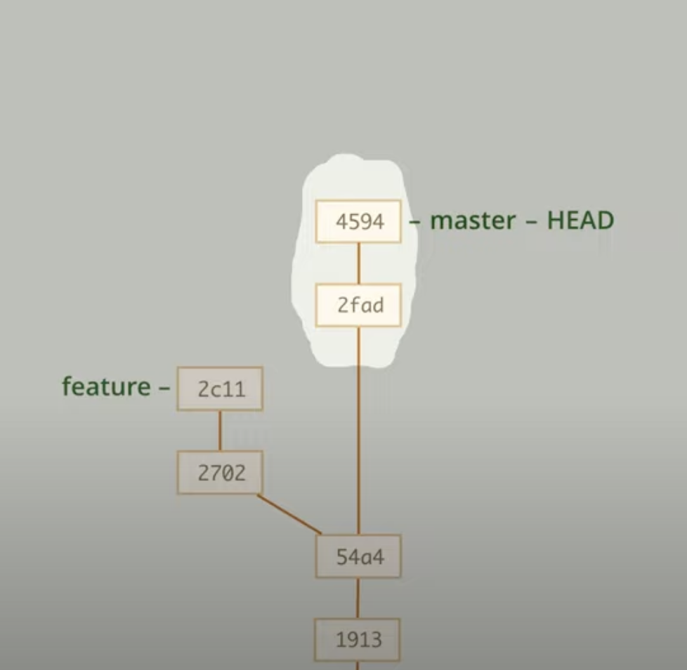
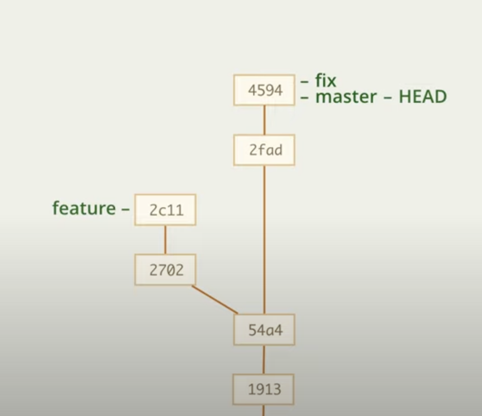
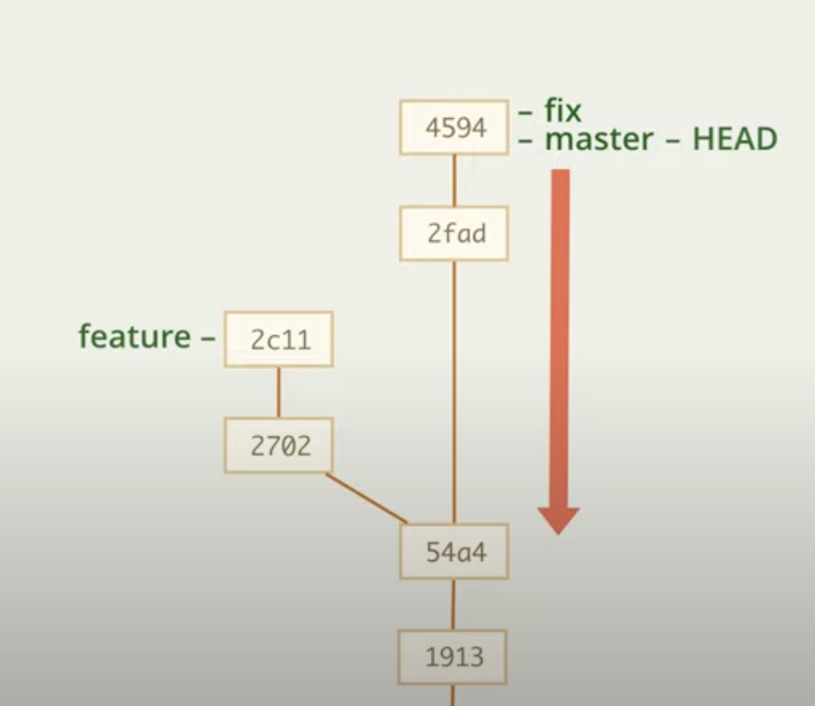
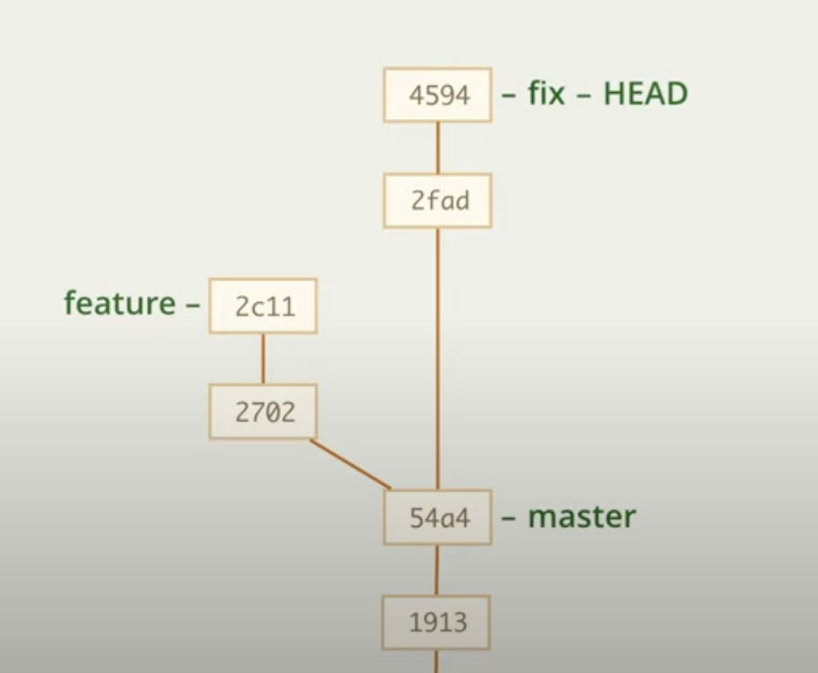

# Ветки

### Полезные штуки

HEAD - текущая ветка

---

### Команды

    git branch ветка - создание ветки
    git checkout ветка - переключение ветки
    git checkout -b ветка - создание и переключение ветки
    git branch -v - посмотреть ветки

    git checkout -f HEAD (git checkout -f) - переключение на ту же ветку, на которой сейчас находимся, флаг -f сотрет все незакомиченные
        данные, тем самым эту команду можно использовать, чтобы откатиться к последнему коммиту, если новые данные
        оказались ненужными 

---

### git stash

Переключение с ветки на ветку возможно только с чистым статусом (либо, когда незакомиченные данные одинаковы на обеих ветках), но если есть незакомиченные данные, а закоммитить 
их нельзя, то можно

1. __Использовать -f (--force)__, тем самым принудительно переключить ветку и стереть все незакомиченные данные

2. __Использовать stash.__ Команда stash архивирует незакомиченные изменения и сохраняет их в кеш. Своего рода буфер обмена.

    *Мы ведем разработку и нам срочно потребовалось
    переключиться на другую ветку, но незакомиченные 
    данные мы пока не можем сбросить или закоммитить*

        git stash

    *Сейчас все незакомиченные данные "стерлись", но остались в кеше, тем самым на данный момент у нас есть пустой коммит данными в кеше*

        git checkout новая ветка
        ... поработали с другой веткой...
        git checkout старая ветка

    *Мы вернулись на нашу первоначальную ветку, но тут сейчас нет наших старых данных*

        git stash pop

    *Данные вернулись из кеша*

    __Stash можно использовать на одной ветке, а восстонавливать на другой, но так можно допустить ошибку__

---

### Перенос незакомиченных данных

Если мы вели разработку (Не коммитили!!!), но в итоге поняли, что изменения очень большие требуют новую ветку, то мы можем ввести

    git checkout -b новая ветка

тем самым мы окажемся на новой ветке с нашими незакомиченными данными, а затем уже выполнить коммит

---

### Перенос закомиченных данных

---
#### Доп информация

Команда вида

    git branch |name_br| |id_commit|
    git branch newFeature 5ee4

создает новую ветку на определенном коммите. Коммит можно указать в виде 4-значного id или названия другой ветки, которая на нем есть (если есть, разумеется)

    git branch newFeature 5ee4
    git branch newFeature anyBranch

Но, если мы хотим создать ветку, которую уже используем, то нужно применить -f

    git branch -f master 5ee4

В данном случае мы не создаем новую ветку, а перемещаем ее на нужный коммит

__Но делать это нужно НЕ НАХОДЯСЬ на этой ветке!!!__

Так же можно использовать другие команды

    git checkout -b newBranch 5ee4 - создает новую ветку на определнном коммите и переходит на нее
    git checkout -B newBranch 5ee4 - то же самое, но если ветка уже есть, то она передвинется

---

Может произойти такое, что мы находимся на ветке, сделали уже несколько коммитов и поняли, что все эти коммиты нужно было делать на другой ветке

Для решения нам нужно

1. Создать на последнем коммите новую ветку (пусть будет Fix)

        git branch fix

    

    Теперь для решения проблемы на просто нужно передвинуть ветку master назад на несколько коммитов

    

2. Переходим на ветку fix

        git checkout fix 

3. Перемещаем ветку master на два коммита назад

        git branch -f master 54a4

    
---