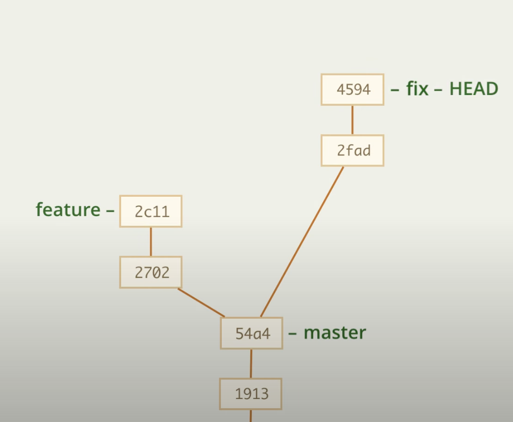
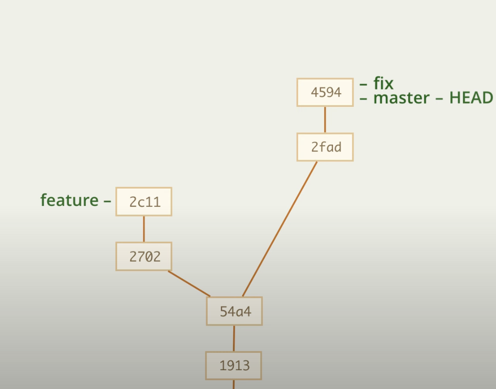

# Слияние веток "перемоткой"

## Слияние

Представим, что у нас есть ветка fix, в которой мы внесли изменения и теперь их нужно объединить с веткой master

Для слияния нам потребуется 

1. Перейти на ветку master

        git checkout master

2. Затем объединить ветки

        git merge fix

## Откат

Если нам требуется вернуться назад, но можно сделать так

    git branch -f master 54a4

В данном случае 54a4 - это id коммита, на который мы возвращаем master, но в реальной жизни мы можем его не помнить, тогда можно воспользоваться __ORIG_HEAD__

    git branch -f master ORIG_HEAD

команда merge перед переносом ветки записывается старый идентификатор в переменную __ORIG_HEAD__, которую можно использовать, как ссылку