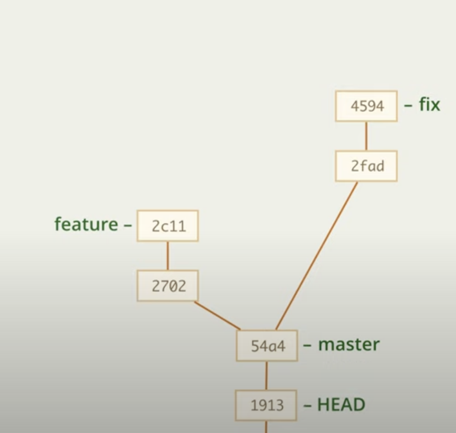
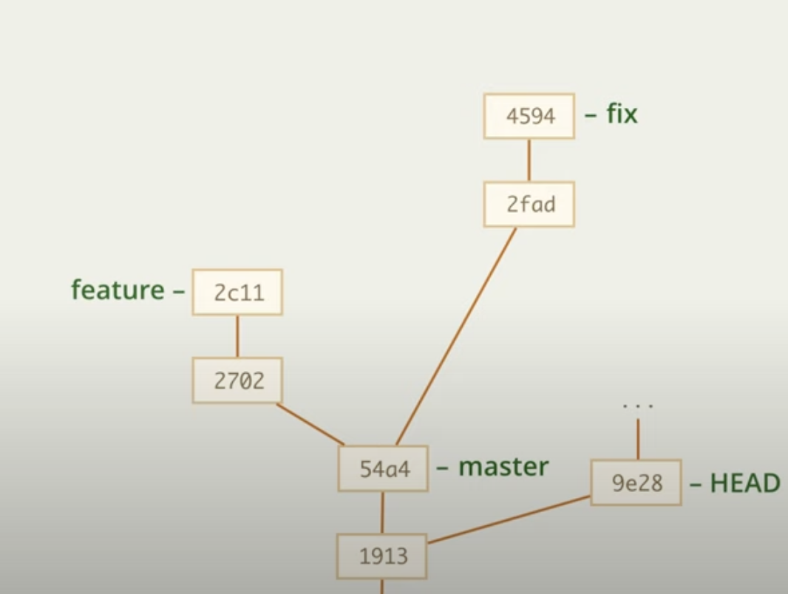

# Состояние отделённой HEAD

С помощью команды 

    git checkout |id_commit|
    git checkout 1913

мы можем перейти к абсолютно любому коммиту

в таком случае мы переходим на конкретный коммит и наш head "отделяется", так как он не привязан ни к какой ветке

Проблемы появляются тогда, когда мы начинаем делать коммиты из этого коммита, получается подобная картина

Неудобства в том, что если мы уйдем с этой безымянной ветки, то вернуться мы сможем вернуться к ней только по id коммита этой ветки, а это

1. Неудобно
1. Git со временем удаляет такие безымянные ветви

---

## Решение

1. Можно создать на последнем коммите безымянной ветви новую ветвь

        git branch |newBranch| 9e28

    И тогда безымянная ветвь будет иметь имя

2. Можно использовать копирование коммита/ов с помощью git cherry-pick