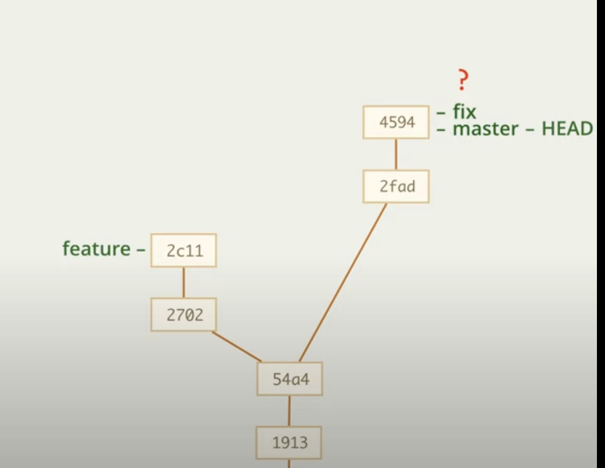
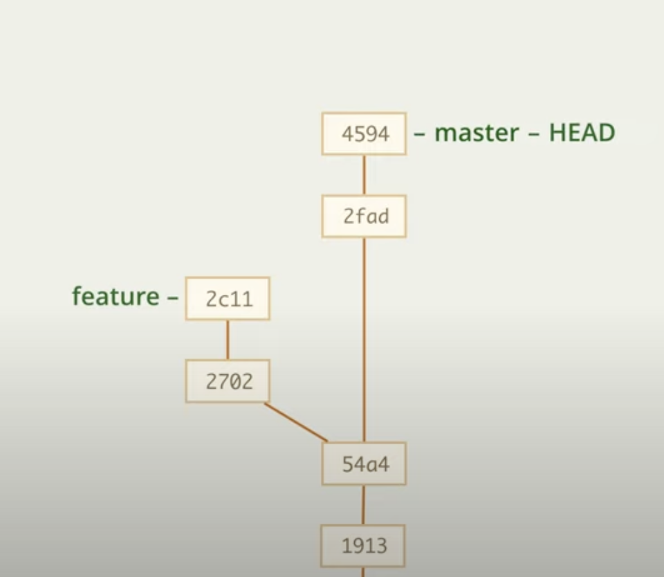
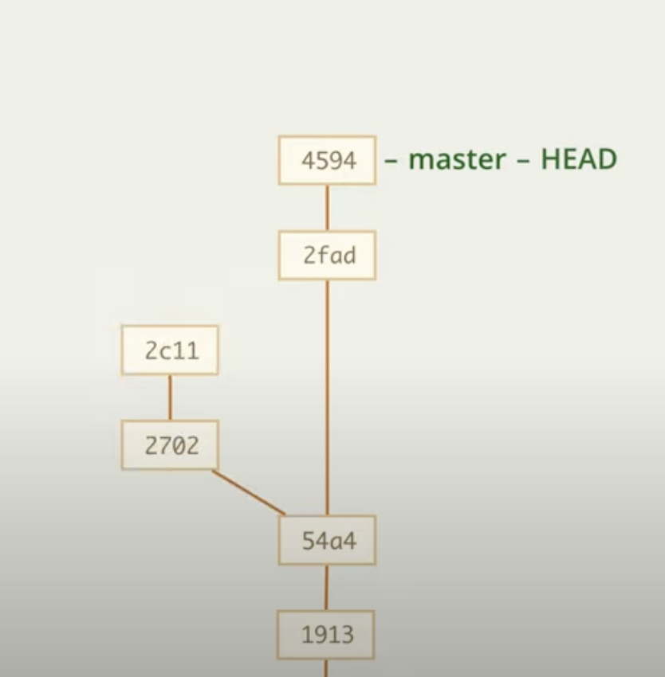

# Удаление веток

Представим, что у нас вот такая ситуация

то есть, у нас есть 3 ветки, 2 из которых ссылаются на один и тот же коммит. Представим, что ветка fix уже сделала свою работу и уже объединена с master, в таком случае она нам больше не нужна

__Удалить__ эту ветку можно с помощью 

    git branch -d |name_branch|
    git branch -d fix

Но такое поведение возможно только тогда, когда ветка объединена с другой веткой, то есть, если мы попробуем проделать то же самое с веткой feature, то будет ошибка, так как коммиты не были объединены куда-то. 

## Удаление тупиковой ветки

Если все-таки из примера выше нам требуется удалить тупиковую ветку, то сделать это можно с помощью

    git branch -D |name_branch|
    git branch -D feature

То есть, ветка не будет удалена полностью, будет удалено название, а коммиты станут _недостижимыми_. Через некоторое время такие коммиты будут удалены

## Восстановление тупиковой ветки

Если требуется восстановить тупиковую ветку, то сделать это можно с помощью создания новой одноименной ветки на нужно месте

    git branch |new_name_branch| |id_commit|
    git branch feature 2c11