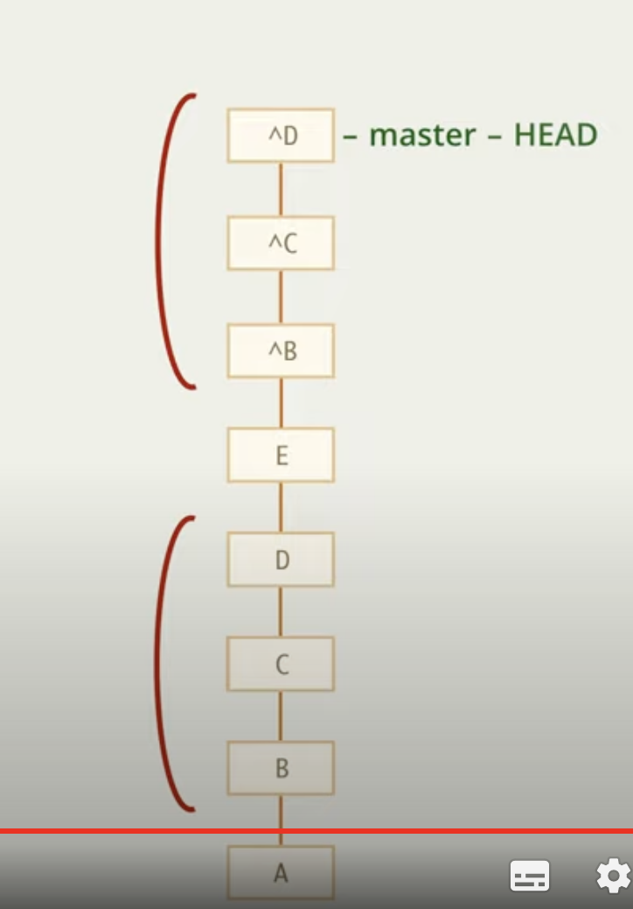

# Отмена коммитов

Отменить коммит можно, но если мы его уже отправили, то нет

Но можно сделать обратный коммит, то есть коммит, в котором будут сделаны обратные изменения

    git revert |id_commit|

Эта команда сделает коммит с обратными изменениями

Так же можно сделать несколько обратных коммитов

    git revert |id_commit_start|..|id_commit_end|
    git revert A..D --- A не включительно

