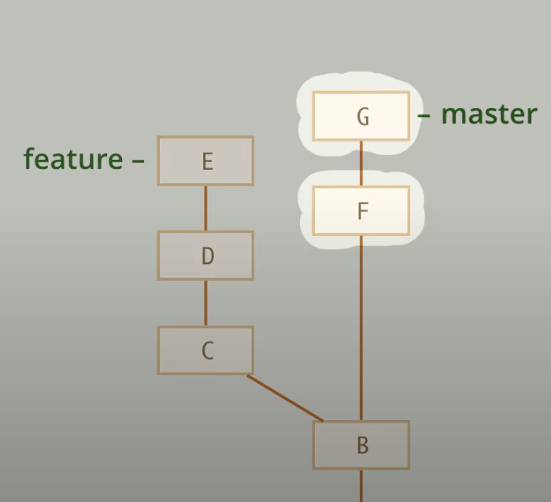
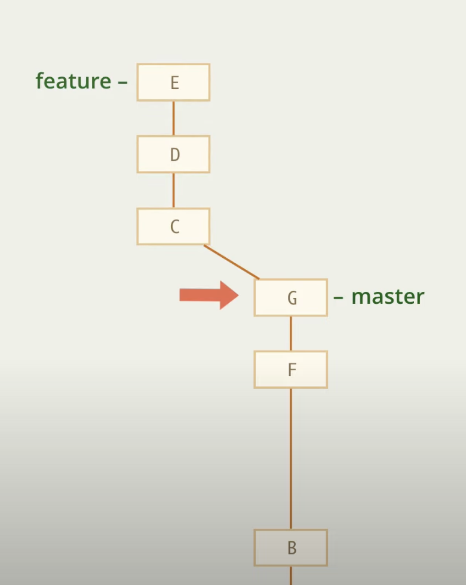
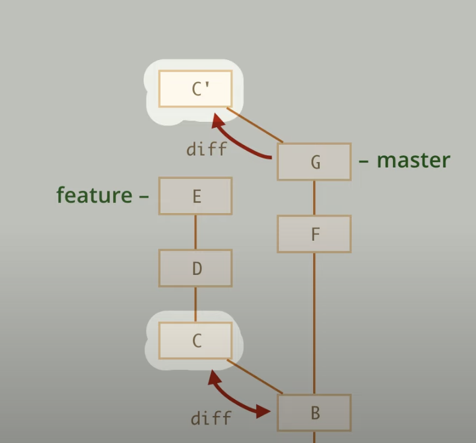
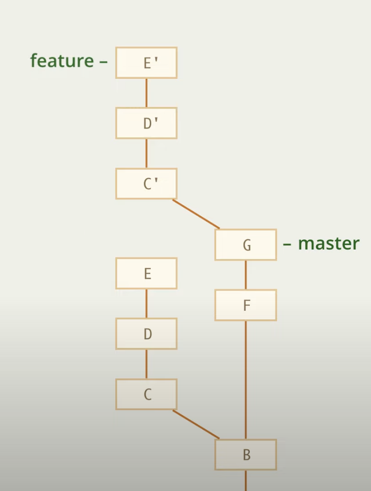

# Rebase

Базовое применение команды rebase это перебазирование веток

Представим, что мы ведем разработку в ветке feature, но после разделения в мастере произошли изменения, которые нам было бы тоже полезно иметь в ветке feature

В данном случае я бы хотел сделать так, чтоб моя ветка feature начиналась тепреь с другого места 

Это делается при помощи команды 

    git rebase |id_commit|
    git rebase master

## Принцип работы rebase

Rebase по сути работает схожим образом, как cherry-pick, то есть в нашем ситуации было так:

1. Были взяты все изменения коммита C и скопированы на G, получив новый коммит C'

    

2. То же самое с коммитом D, получив D'
3. То же самое с коммитом E, получив E'
4. Ссылка feature переносится на последний новый коммит E'
    

## Конфликт

При выполнении этих шагов мог произойти конфликт, представим, что он произошел на 2 шаге выше

То есть на данный момент у нас есть один новый коммит C' и сейчас мы в состоянии разрешения конфликта

В данный момент rebase останавливается и предлогает нам разрешить конфликт

Есть несколько вариантов дальнейших действий 

1. Отмена и возврат к состоянию до rebase

        git rebase --abort

    НЕ СРАБОТАЕТ КОМАНДА

        git reset --hard

2. Частично выполненное перебазирование

        git rebase --quit

3. Пропустить коммит

        git rebase --skip

4. Продолжить (после решения конфликта)

        git rebase --continue