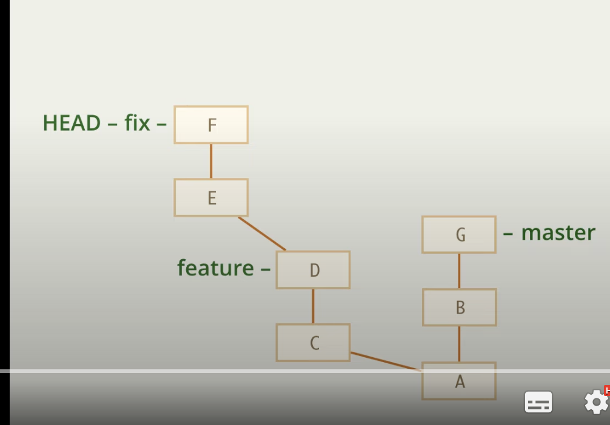
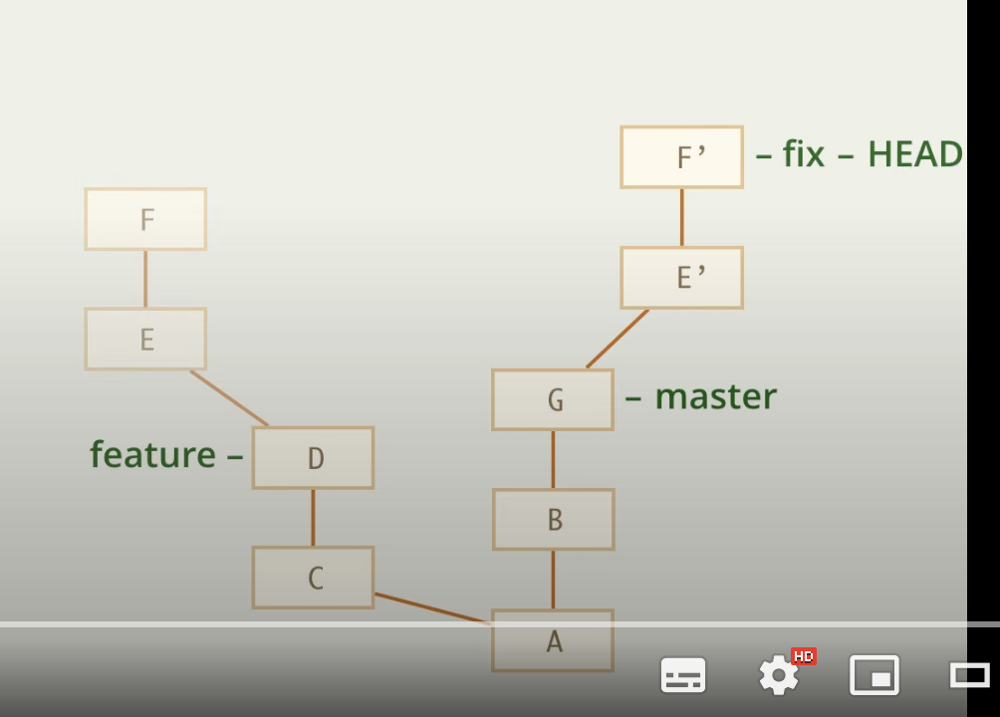

# Rebase --onto

Представим, что мы по ошибке начали новую ветку fix из feature, хотя нужно было из master

Для исправления мы можем воспользоваться rebase

    git rebase master

Но тогда на мастер уйдет вся ветка (feature тоже), но нам нужно было только fix (2 коммита)

Для решения нам потребуется флаг --onto

Он означает, с какого коммита начинается rebase

    git rebase --onto |коммит_куда_переносим| |коммит_с_какого_переносим|
    git rebase --onto master feature

