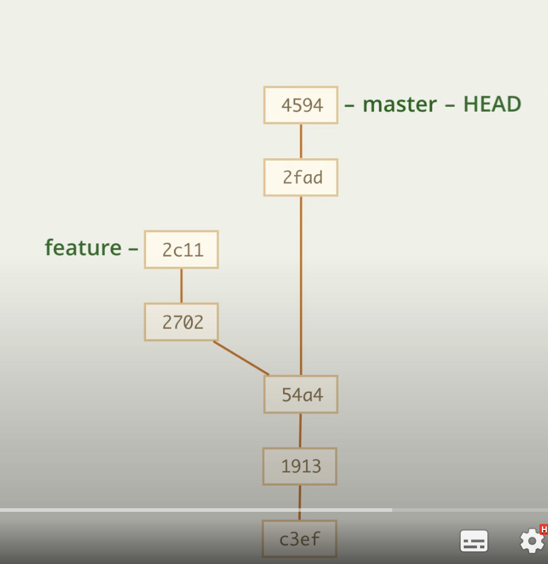
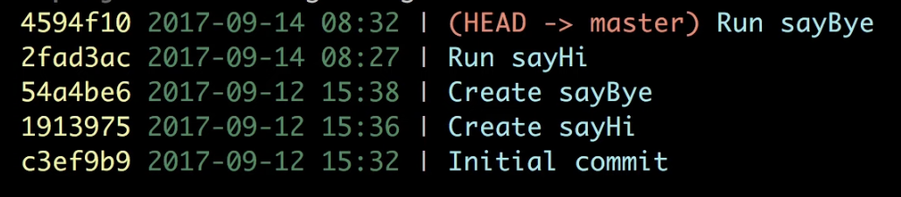
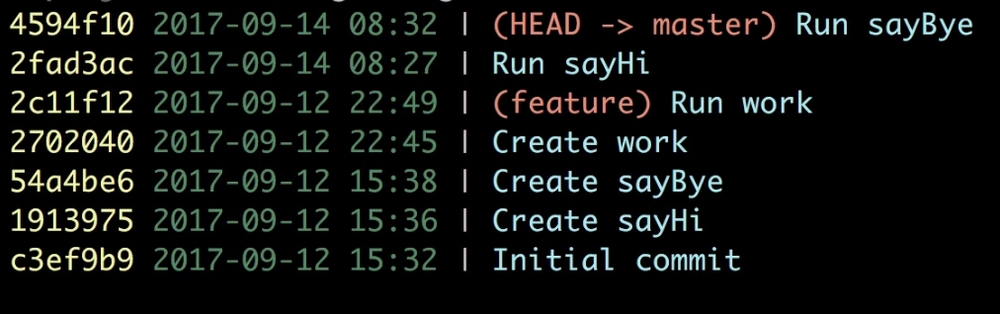
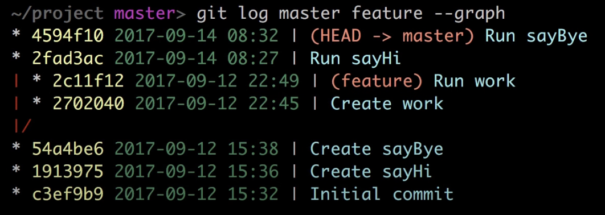
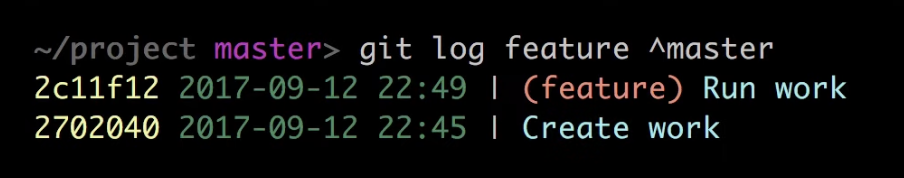
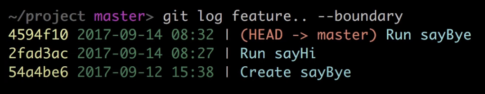
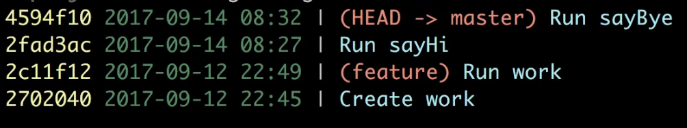
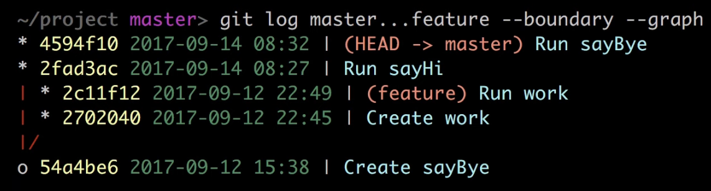

# Диапозоны коммитов

Изначально команда

    git log

выводит цепочку коммитов от HEAD

Если же нам нужна цепочка коммитов от какого-то другого, то нам надо указать

    git log |commit_id|
    git log master

В случае с master результат будет тот же

 
---
## Вывод цепочки с нескольких веток

Если нам требуется вывести цепочку с нескольких веток, то мы можем указывать несколько коммитов в команде

    git log |commit_id_1| |commit_id_2|
    git log master feature

---
## Вывод цепочки с графами --graph

Предыдущий вариант не показывает наглядно, где какая ветка

Если нам требует графически изобразить графы, то добавим __--graph__

    git log master feature --graph

---
## Вывод всего дерева --all

Предыдущий вариант выводил только те ветки, которые мы указали, но если нам нужно вывести все дерево, то можно использова __--all__

    git log master feature --all --graph

В нашем случае результат не будет отличаться

---
## Выбор графической утилиты

    git gui

---
## Просмотр ветки с момента ее отхождения от другой ^

Иногда может потребоваться посмотреть коммиты ветки с момента ее отхождения от другой ветки, например, посмотреть коммиты ветки feature без коммитов ветки master. Это можно сделать с помощью ^, она убирает все коммиты, относящиеся к выбранной ветке

    git log feature ^master

--- 

Еще один вариант записи выше

    git log feature..master

А так же, если одна из ссылок HEAD, то ее можно не писать, то есть

    git log feature..
    git log ..feature

--- 
В примерах выше пропускается пограничный коммит, если он нужен, то надо добавить --boundary

    git log feature.. --boundary

---
## Симметрическая разность ...

Если нам требуется посмотреть коммиты из двух веток, но без тех, котораые являются для них общими, то может воспользоваться ...

    git log master...feature

---

Так же можно добавить границы и отрисовку 

    git log master...feature --boundary --graph

