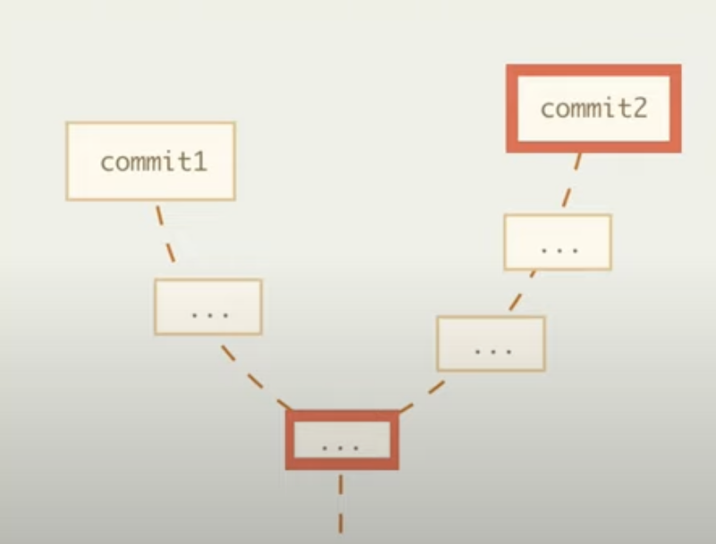
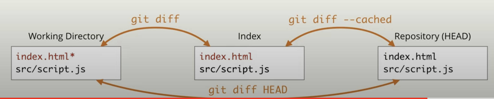

# Сравнение

## Сравнение двух коммитов

    git diff |commit1| |commit2|
    git diff 23e4 master

    или

    git diff |commit1|..|commit2|
    git diff 23e4..master

Сравнение коммита и общего предка

    git diff commit1...commit2

Данная команда сравнит commit2 с коммитом, являющимся общим предком для commit1 и commit2

## Сравнение рабочей директории с индексом и репозиторием

### Сравнение рабочей директории с индексом

    git diff 

__Не видит неотслеживаемые файлы!!!__

### Сравнение рабочей директории с репозиторием на момент какого-то коммита

    git diff commit

### Сравнение рабочей директории с репозиторием на данный момент (что было сделано с момента последнего коммита)

    git diff HEAD || git diff @

### Сравнение индекса с репозиторием на данный момент

    git diff --cached

## Ограничения по пути

К вышеуказанным командам можно применять указания ограничения по путям, добавив

    --<paths>
    git diff --index.html 

Данная команда сравнит файлы index.html в рабочей директории и в индексе

## Сравнение файлов

    git diff commit1:path1 commit2:path2
    git diff commit1:index.html commit2:about.html