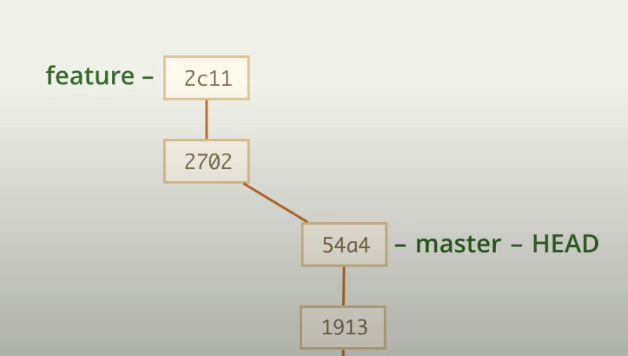
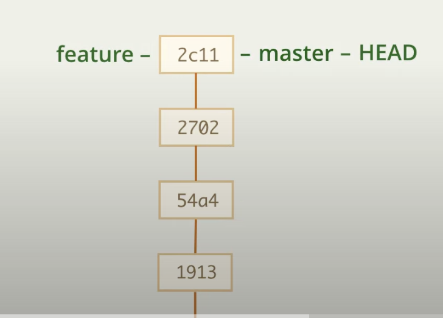
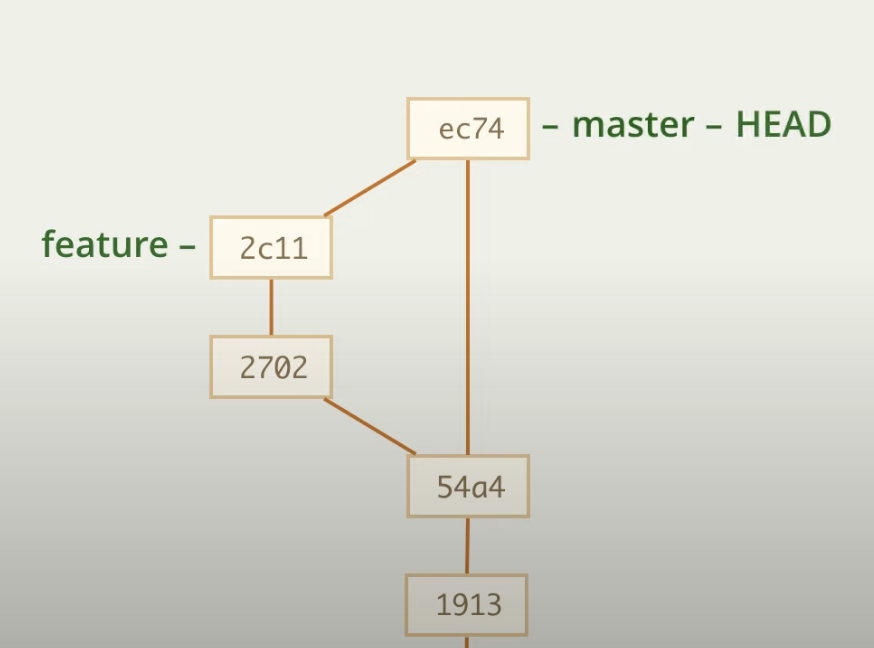

# Запрет перемотки

Рассмотрим такую ситуацию

Мы разрабатывали фичу в отдельной ветке и теперь нам надо ее закинуть в master

Есть вариант перемотки, то есть

    git merge feature

После чего получится вот так

Но вдруг после этого окажется, что все-таки где-то была ошибка, но теперь мы не можем вернуться на коммит, при котором произошло разделение ветки, так как теперь история представляет из себя прямую

Для решения этой проблемы мы можем запретить делать перемотку с помощью флага --no-ff

    git merge --no-ff feature

Теперь история выглядит так

--- 

То есть, кардинально ничего не изменилось, но теперь история выглядит нагляднее

--- 

Эту опцию можно по дефолту поставить в настройках всего гита

    git config merge.ff false

либо определенной ветки

    git config branch.master.mergeoptions '--no-ff'

Теперь обычный merge будет все равно создавать коммит слияния вместо перемотки

Включить обратно можно, добавив флаг --ff