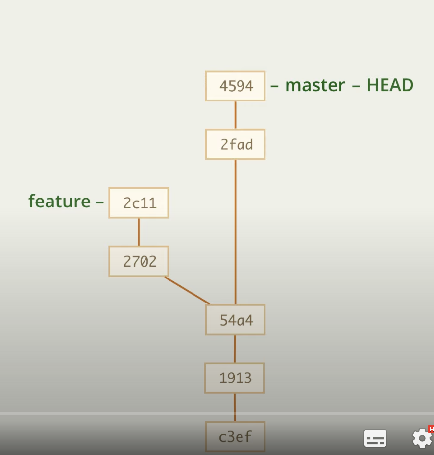
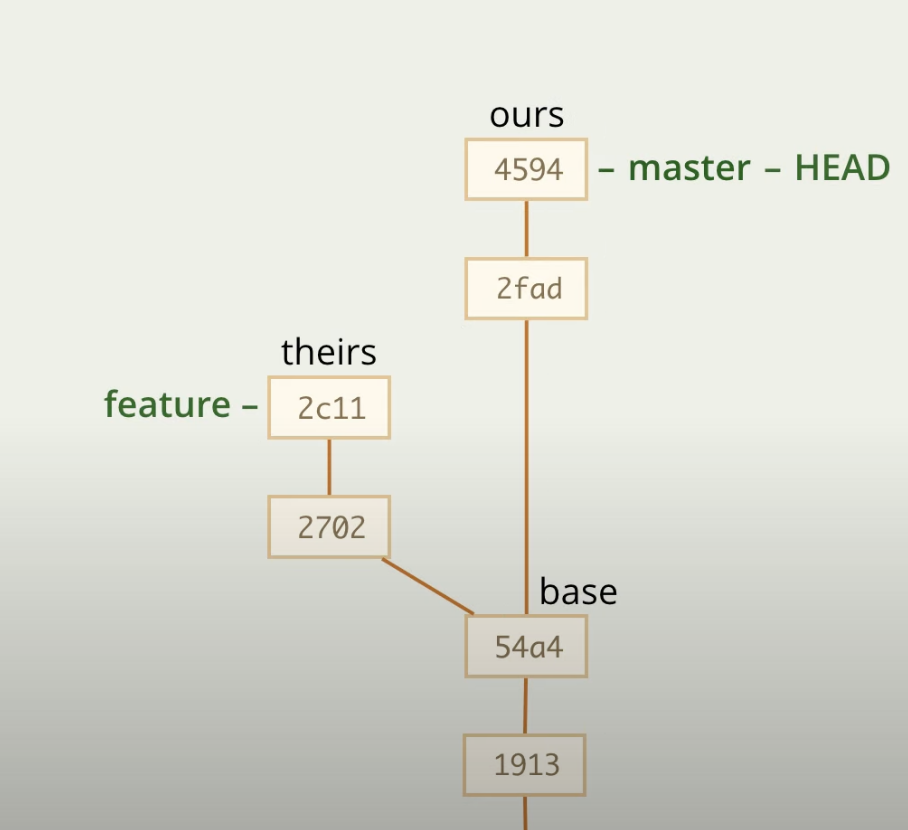

# Истинное слияние

Представим, что у нас есть 2 ветки. Разработку в ветке feature мы закончили и теперь нужно слить ее с master.

Для этого нужен будет merge

Уже был рассмотрен способ слияния перемоткой, в нем ветка как бы "подтягивается" до актуального состояние, в нашем случае так не подойдет, так как и у Feature, и у master присутствуют независимые коммиты

__Перед слияние желателен чистый статус__

Для слияние воспользуемся

    git merge |branch_name|
    git merge feature

После этого git возьмет 3 версии проекта

1. base - ту, на которой ветки разошлись
2. ours - нашу ветку (где HEAD)
2. theirs - ту, с которой сливаем

    весь base + (изменения из ours) + (изменения из theirs) = merge

# Конфликт

Может быть такое, что изменения из ours и изменения из theirs происходят в одном месте, соответственно git не знает, как их вместе объединить

Тогда git переходит в состояние прерванного слияние, это то состояние, в котором git пытается понять, как правильно объединить проект

В таком случае нужно руками поменять файл, в котором происходит конфликт 

Затем

    git add |file_name|

Затем

    git merge --continue

# Отмена слияния в процессе

Жесткий вариант выполняется через

    git reset --hard

Более мягкий вариант выполняется через

    git reset --merge || get merge --abort

# Дальнейшая работа

Указана в виде 7.2

# Отмена слияния

Отменить слияние можно с помощью жесткого reset

    git reset --hard @~

# Отмена отмены слияния

Вернуть слияние можно с помощью жесткого reset

    git reset --hard |id_удаленного_commit|