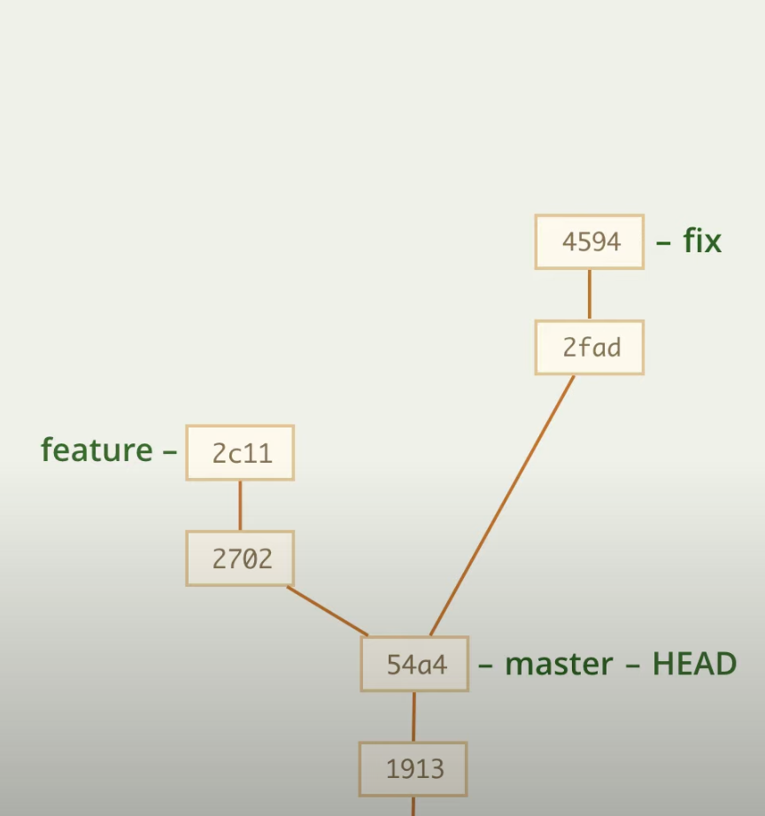
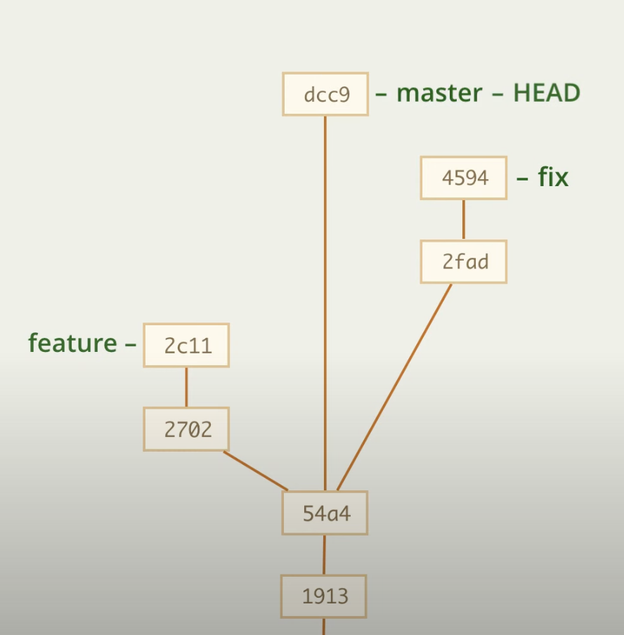

# Создание коммита из ветки: merge --squash

Может произойти такое, что нам нужно слить ветки, но мы не хотим оставлять и показывать целую ветку

Для этого есть флаг --squash, он берет последний коммит ветки и сливает его с нашей веткой, но не делает коммит

    git merge --squash |branch_name|
    git merge --squash fix

    git commit -m 'message'

    

А ту ветку мы можем даже удалить

    git branch -D fix

---

Такой прием может использоваться, если изменения оказались очень незначительными, чтобы создавать отдельную ветку или, например, если коммиты в ветке очень неаакуратные и будут только путать остальных, но результат нас все равно устраивает, тогда было бы логичнее сделать вид, что никакого ветки вовсе не было, а ее результат отправить обычным коммитом в другую ветку. В нашем случае мы так и сделали, мы весь результат fix слили в master следующим коммитом

---

# Нюансы

При использовании 

    merge --squash 

не работают 

    merge --abort 
    merge --continue

но их можно заменить

    merge --abort          |    git reset --merge || --hard
    merge --continue       |    git commit